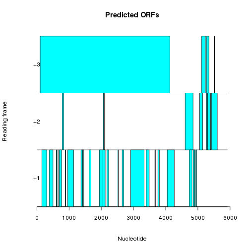
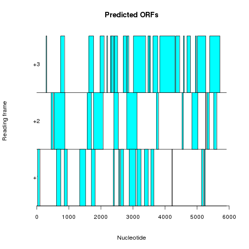

```r
# SFARI gene and variant prioritisation
# main.R is setup and source calls for all associated scripts
# func.R and do.R have more detail for individual functions/tasks
# Setup: Dependencies -----------------------------------------------------

library(stringr)
library(seqinr)
library(ssh.utils)
library("biomaRt")
library(dplyr)
library(xtable)
library(gridExtra)
library(ggplot2)
library(knitr)


# Setup: Options ----------------------------------------------------------

# Gene is either a single string or a vector of strings (a gene list)
# gene.list <- "PTEN" 


gene.list <- data.frame(name = c("PTEN","TBR1", "GRIN2B", "DYRK1A","SYNGAP1"),
                         transcript = c("NM_000314","NM_006593","NM_000834","NM_001396","NM_006772"),
                         chromosome = c(10,2,12,21,6))
i <- 5
gene.i <- gene.list[i,]

opt.annovar.cache = TRUE # If TRUE, check for cached copy of annovar in temp before rerunning 

# Setup: Environment ------------------------------------------------------

setwd("/home/bcallaghan/Projects/SFARI/")
dir.home <- "/home/bcallaghan/Projects/SFARI/"
dir.inputs <- "/home/bcallaghan/Projects/SFARI/inputs/"
dir.outputs <- "/home/bcallaghan/Projects/SFARI/outputs/"
dir.plots <- "/home/bcallaghan/Projects/SFARI/plots/"
dir.cor.plots <- "/home/bcallaghan/Projects/SFARI/plots/corr"
dir.temp <- "/home/bcallaghan/Projects/SFARI/temp/"

path.fasta <- paste0(dir.inputs,gene.i$name,".fa")
path.annovar.out <- paste0(dir.temp,gene.i$name,"_anno.hg19_multianno.csv")
path.annovar.out2 <- paste0(dir.temp,gene.i$name,"_anno2.hg19_cadd_dropped")
path.pp.out <- paste0(dir.inputs, gene.i$name, "PP.tsv")
path.marv <- paste0(dir.inputs,"MARV_ASD_muts_hg19_multianno.csv")
path.anno.in <- paste0(dir.temp,as.character(gene.i$name),"_anno_in")
path.gene.metrics <- paste0(dir.outputs,"gene_level_info")


# Setup: Tests ------------------------------------------------------------


# Source Calls ------------------------------------------------------------

source("func.R")
source("load.R")
```

```
## Extra content at the end of the document
```

```
## Error: 1: Extra content at the end of the document
```

```r
source("clean.R")
```



```
## 1343 Predict Protein amino acids
## 1344 Isoform amino acids
## 72.38757 % Amino acid Alignment
```

```
## Warning in unfactorizeVariantCols(vars.filtered): NAs introduced by
## coercion
```


```r
source("do.R")
```

```
## [1] "Biomart FASTA, refseq ID NP_006763"
## [1] "MSRSRASIHRGSIPAMSYAPFRDVRGPSMHRTQYVHSPYDRPGWNPRFCIISGNQLLMLDEDEIHPLLIRDRRSESSRNKLLRRTVSVPVEGRPHGEHEYHLGRSRRKSVPGGKQYSMEGAPAAPFRPSQGFLSRRLKSSIKRTKSQPKLDRTSSFRQILPRFRSADHDRARLMQSFKESHSHESLLSPSSAAEALELNLDEDSIIKPVHSSILGQEFCFEVTTSSGTKCFACRSAAERDKWIENLQRAVKPNKDNSRRVDNVLKLWIIEARELPPKKRYYCELCLDDMLYARTTSKPRSASGDTVFWGEHFEFNNLPAVRALRLHLYRDSDKKRKKDKAGYVGLVTVPVATLAGRHFTEQWYPVTLPTGSGGSGGMGSGGGGGSGGGSGGKGKGGCPAVRLKARYQTMSILPMELYKEFAEYVTNHYRMLCAVLEPALNVKGKEEVASALVHILQSTGKAKDFLSDMAMSEVDRFMEREHLIFRENTLATKAIEEYMRLIGQKYLKDAIGEFIRALYESEENCEVDPIKCTASSLAEHQANLRMCCELALCKVVNSHCVFPRELKEVFASWRLRCAERGREDIADRLISASLFLRFLCPAIMSPSLFGLMQEYPDEQTSRTLTLIAKVIQNLANFSKFTSKEDFLGFMNEFLELEWGSMQQFLYEISNLDTLTNSSSFEGYIDLGRELSTLHALLWEVLPQLSKEALLKLGPLPRLLNDISTALRNPNIQRQPSRQSERPRPQPVVLRGPSAEMQGYMMRDLNSSIDLQSFMARGLNSSMDMARLPSPTKEKPPPPPPGGGKDLFYVSRPPLARSSPAYCTSSSDITEPEQKMLSVNKSVSMLDLQGDGPGGRLNSSSVSNLAAVGDLLHSSQASLTAALGLRPAPAGRLSQGSGSSITAAGMRLSQMGVTTDGVPAQQLRIPLSFQNPLFHMAADGPGPPGGHGGGGGHGPPSSHHHHHHHHHHRGGEPPGDTFAPFHGYSKSEDLSSGVPKPPAASILHSHSYSDEFGPSGTDFTRRQLSLQDNLQHMLSPPQITIGPQRPAPSGPGGGSGGGSGGGGGGQPPPLQRGKSQQLTVSAAQKPRPSSGNLLQSPEPSYGPARPRQQSLSKEGSIGGSGGSGGGGGGGLKPSITKQHSQTPSTLNPTMPASERTVAWVSNMPHLSADIESAHIEREEYKLKEYSKSMDESRLDRVKEYEEEIHSLKERLHMSNRKLEEYERRLLSQEEQTSKILMQYQARLEQSEKRLRQQQAEKDSQIKSIIGRLMLVEEELRRDHPAMAEPLPEPKKRLLDAQERQLPPLGPTNPRVTLAPPWNGLAPPAPPPPPRLQITENGEFRNTADH*"
## [1] "Translated cdna FASTA, refseq ID NM_006772"
## [1] "MSRSRASIHRGSIPAMSYAPFRDVRGPSMHRTQYVHSPYDRPGWNPRFCIISGNQLLMLDEDEIHPLLIRDRRSESSRNKLLRRTVSVPVEGRPHGEHEYHLGRSRRKSVPGGKQYSMEGAPAAPFRPSQGFLSRRLKSSIKRTKSQPKLDRTSSFRQILPRFRSADHDRARLMQSFKESHSHESLLSPSSAAEALELNLDEDSIIKPVHSSILGQEFCFEVTTSSGTKCFACRSAAERDKWIENLQRAVKPNKDNSRRVDNVLKLWIIEARELPPKKRYYCELCLDDMLYARTTSKPRSASGDTVFWGEHFEFNNLPAVRALRLHLYRDSDKKRKKDKAGYVGLVTVPVATLAGRHFTEQWYPVTLPTGSGGSGGMGSGGGGGSGGGSGGKGKGGCPAVRLKARYQTMSILPMELYKEFAEYVTNHYRMLCAVLEPALNVKGKEEVASALVHILQSTGKAKDFLSDMAMSEVDRFMEREHLIFRENTLATKAIEEYMRLIGQKYLKDAIGEFIRALYESEENCEVDPIKCTASSLAEHQANLRMCCELALCKVVNSHCVFPRELKEVFASWRLRCAERGREDIADRLISASLFLRFLCPAIMSPSLFGLMQEYPDEQTSRTLTLIAKVIQNLANFSKFTSKEDFLGFMNEFLELEWGSMQQFLYEISNLDTLTNSSSFEGYIDLGRELSTLHALLWEVLPQLSKEALLKLGPLPRLLNDISTALRNPNIQRQPSRQSERPRPQPVVLRGPSAEMQGYMMRDLNSSIDLQSFMARGLNSSMDMARLPSPTKEKPPPPPPGGGKDLFYVSRPPLARSSPAYCTSSSDITEPEQKMLSVNKSVSMLDLQGDGPGGRLNSSSVSNLAAVGDLLHSSQASLTAALGLRPAPAGRLSQGSGSSITAAGMRLSQMGVTTDGVPAQQLRIPLSFQNPLFHMAADGPGPPGGHGGGGGHGPPSSHHHHHHHHHHRGGEPPGDTFAPFHGYSKSEDLSSGVPKPPAASILHSHSYSDEFGPSGTDFTRRQLSLQDNLQHMLSPPQITIGPQRPAPSGPGGGSGGGSGGGGGGQPPPLQRGKSQQLTVSAAQKPRPSSGNLLQSPEPSYGPARPRQQSLSKEGSIGGSGGSGGGGGGGLKPSITKQHSQTPSTLNPTMPASERTVAWVSNMPHLSADIESAHIEREEYKLKEYSKSMDESRLDRVKEYEEEIHSLKERLHMSNRKLEEYERRLLSQEEQTSKILMQYQARLEQSEKRLRQQQAEKDSQIKSIIGRLMLVEEELRRDHPAMAEPLPEPKKRLLDAQERQLPPLGPTNPRVTLAPPWNGLAPPAPPPPPRLQITENGEFRNTADH*"
## [1] "PredictProtein Parsed FASTA"
## [1] "MSRSRASIHRGSIPAMSYAPFRDVRGPSMHRTQYVHSPYDRPGWNPRFCIISGNQLLMLDEDEIHPLLIRDRRSESSRNKLLRRTVSVPVEGRPHGEHEYHLGRSRRKSVPGGKQYSMEGAPAAPFRPSQGFLSRRLKSSIKRTKSQPKLDRTSSFRQILPRFRSADHDRARLMQSFKESHSHESLLSPSSAAEALELNLDEDSIIKPVHSSILGQEFCFEVTTSSGTKCFACRSAAERDKWIENLQRAVKPNKDNSRRVDNVLKLWIIEARELPPKKRYYCELCLDDMLYARTTSKPRSASGDTVFWGEHFEFNNLPAVRALRLHLYRDSDKKRKKDKAGYVGLVTVPVATLAGRHFTEQWYPVTLPTGSGGSGGMGSGGGGGSGGGSGGKGKGGCPAVRLKARYQTMSILPMELYKEFAEYVTNHYRMLCAVLEPALNVKGKEEVASALVHILQSTGKAKDFLSDMAMSEVDRFMEREHLIFRENTLATKAIEEYMRLIGQKYLKDAIGEFIRALYESEENCEVDPIKCTASSLAEHQANLRMCCELALCKVVNSHCVFPRELKEVFASWRLRCAERGREDIADRLISASLFLRFLCPAIMSPSLFGLMQEYPDEQTSRTLTLIAKVIQNLANFSKFTSKEDFLGFMNEFLELEWGSMQQFLYEISNLDTLTNSSSFEGYIDLGRELSTLHALLWEVLPQLSKEALLKLGPLPRLLNDISTALRNPNIQRQPSRQSERPRPQPVVLRGPSAEMQGYMMRDLNSSIDLQSFMARGLNSSMDMARLPSPTKEKPPPPPPGGGKDLFYVSRPPLARSSPAYCTSSSDITEPEQKMLSVNKSVSMLDLQGDGPGGRLNSSSVSNLAAVGDLLHSSQASLTAALGLRPAPAGRLSQGSGSSITAAGMRLSQMGVTTDGVPAQQLRIPLSFQNPLFHMAADGPGPPGGHGGGGGHGPPSSHHHHHHHHHHRGGEPPGDTFAPFHGYSKSEDLSSGVPKPPAASILHSHSYSDEFGPSGTDFTRRQLSLQDNLQHMLSPPQITIGPQRPAPSGPGGGSGGGSGGGGGGQPPPLQRGKSQQLTVSAAQKPRPSSGNLLQSPEPSYGPARPRQQSLSKEGSIGGSGGSGGGGGGGLKPSITKQHSQTPSTLNPTMPASERTVAWVSNMPHLSADIESAHIEREEYKLKEYSKSMDESRLDRVKEYEEEIHSLKERLHMSNRKLEEYERRLLSQEEQTSKILMQYQARLEQSEKRLRQQQAEKDSQIKSIIGRLMLVEEELRRDHPAMAEPLPEPKKRLLDAQERQLPPLGPTNPRVTLAPPWNGLAPPAPPPPPRLQITENGEFRNTADH*"
## [1] "Input and calculated fastas all agree"
## [1] "** fasta files missing, fix before prioritisation**"   
## [2] "** caddanno files missing, fix before prioritisation**"
## ALL==============0SYNONYMOUS===============
```

```
## Warning in find_gene_scores(vars.filtered, anno.df): NAs introduced by
## coercion
```

```
## Warning in find_gene_scores(vars.filtered, anno.df): NAs introduced by
## coercion
```

```
## Warning in write.table(gene.i.scores, path.gene.metrics, append = TRUE):
## appending column names to file
```

```
## Warning in plot_pairs_damage_scores(vars.filtered, dir.cor.plots,
## as.character(gene.i$name)): NAs introduced by coercion

## Warning in plot_pairs_damage_scores(vars.filtered, dir.cor.plots,
## as.character(gene.i$name)): NAs introduced by coercion
```

```
## Warning in (function (data, mapping, alignPercent = 0.6, method =
## "pearson", : Removed 99 rows containing missing values
```

```
## Warning in (function (data, mapping, alignPercent = 0.6, method =
## "pearson", : Removed 99 rows containing missing values
```

```
## Warning in (function (data, mapping, alignPercent = 0.6, method =
## "pearson", : Removed 99 rows containing missing values
```

```
## Warning in (function (data, mapping, alignPercent = 0.6, method =
## "pearson", : Removed 99 rows containing missing values
```

```
## Warning: Removed 99 rows containing missing values (geom_point).

## Warning: Removed 99 rows containing missing values (geom_point).
```

```
## Warning: Removed 99 rows containing non-finite values (stat_density).
```

```
## Warning in (function (data, mapping, alignPercent = 0.6, method =
## "pearson", : Removed 99 rows containing missing values
```

```
## Warning in (function (data, mapping, alignPercent = 0.6, method =
## "pearson", : Removed 99 rows containing missing values
```

```
## Warning: Removed 99 rows containing non-finite values (stat_boxplot).
```

```
## Warning: Removed 99 rows containing missing values (geom_point).

## Warning: Removed 99 rows containing missing values (geom_point).

## Warning: Removed 99 rows containing missing values (geom_point).
```

```
## Warning: Removed 99 rows containing non-finite values (stat_density).
```

```
## Warning in (function (data, mapping, alignPercent = 0.6, method =
## "pearson", : Removed 99 rows containing missing values
```

```
## Warning: Removed 99 rows containing non-finite values (stat_boxplot).
```

```
## Warning: Removed 99 rows containing missing values (geom_point).

## Warning: Removed 99 rows containing missing values (geom_point).
```

```
## `stat_bin()` using `bins = 30`. Pick better value with `binwidth`.
## `stat_bin()` using `bins = 30`. Pick better value with `binwidth`.
## `stat_bin()` using `bins = 30`. Pick better value with `binwidth`.
```

```
## Warning: Removed 99 rows containing non-finite values (stat_bin).
```

```
## `stat_bin()` using `bins = 30`. Pick better value with `binwidth`.
```

```
## Warning: Removed 99 rows containing non-finite values (stat_bin).
```

```
## `stat_bin()` using `bins = 30`. Pick better value with `binwidth`.
```

```
## Saving 8.57 x 6.17 in image
## Saving 8.57 x 6.17 in image
## Saving 8.57 x 6.17 in image
```

