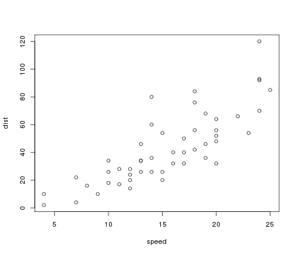

Title
========================================================

This is an R Markdown document. Markdown is a simple formatting syntax for authoring web pages (click the **Help** toolbar button for more details on using R Markdown).

When you click the **Knit HTML** button a web page will be generated that includes both content as well as the output of any embedded R code chunks within the document. You can embed an R code chunk like this:


```
## Warning in file(con, "r"): cannot open file 'main.R': No such file or
## directory
```

```
## Error in file(con, "r"): cannot open the connection
```


```r
table(marv.res$Gene.refGene)[table(marv.res$Gene.refGene) > 2]
```

```
## Error in table(marv.res$Gene.refGene): object 'marv.res' not found
```

You can also embed plots, for example:


```r
plot(cars)
```



